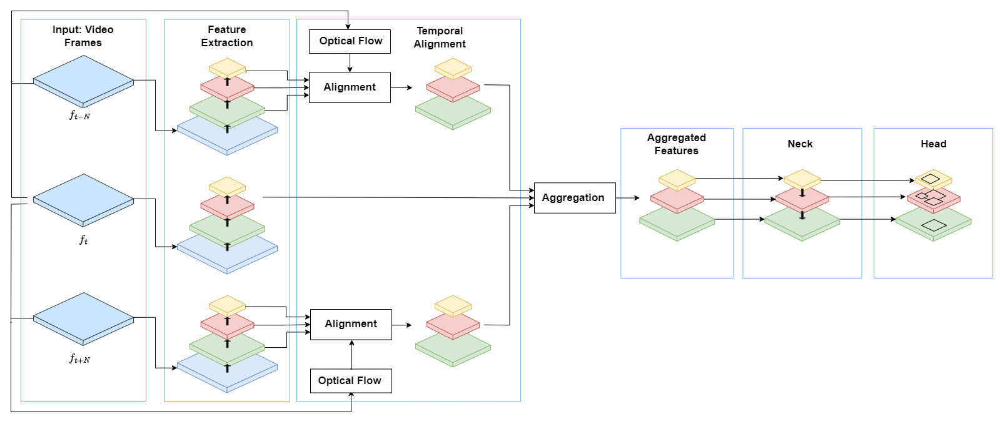

# Micro_Mobility_Detection

# Detection of Micromobility Vehicles in Urban Traffic Videos


This project introduces a novel object detection model, FGFA-YOLOX, specifically designed to enhance the detection of micromobility vehicles (MMVs) such as e-scooters, bikes, and skateboards in urban traffic videos. By integrating the accuracy and speed of single-frame detection with the enriched temporal features of video-based frameworks, FGFA-YOLOX significantly advances the state-of-the-art in urban mobility analytics.

## Key Contributions

- Introduction of the FGFA-YOLOX model, offering a significant leap in detecting micromobility vehicles within urban settings.
- Construction of a comprehensive dataset focused on urban micromobility, aiming to propel further research by making it publicly available.

## Model Architecture

Below is the architecture of our FGFA-YOLOX model, illustrating the innovative integration of spatio-temporal features for enhanced object detection in complex urban environments.



## Dataset

Our custom PolyMMV dataset is tailored to address the unique challenges of detecting MMVs in densely populated urban areas. For more information on accessing and utilizing the dataset, please visit [our dataset documentation](./data).

## Getting Started

For detailed instructions on setting up the project environment and running the FGFA-YOLOX model, please refer to the [installation guide](./installation).

## Citation

If you find our work useful in your research, please cite:

```bibtex
@article{your_citation_here,
  title={Detection of Micromobility Vehicles in Urban Traffic Videos},
  author={Your authors here},
  journal={Your journal here},
  year={Year}
}
